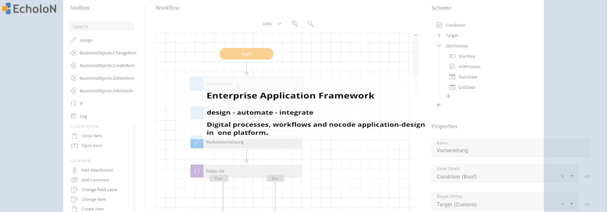

  

# EcholoN Software

**Enterprise Application Framework for digital processes, service management, workflow automation and structured documentation.**

EcholoN enables organizations to design, operate and integrate business applications based on configurable processes, workflows, roles, forms, data structures and interfaces.

The platform is used for service management, enterprise workflows, customer service, quality processes, complaint management, field service, maintenance, self-service portals and individual business applications.

---

## Build digital business applications with EcholoN

EcholoN is designed for organizations that need more than isolated tools or rigid standard software.

With EcholoN, teams can create structured applications for recurring business processes, connect departments, automate workflows and document activities in a traceable way.

Typical use cases include:

- IT Service Management
- Enterprise Service Management
- Customer Service Management
- Complaint Management
- Quality and Compliance Processes
- Field Service and Maintenance
- Asset and Configuration Management
- Self-Service Portals
- Structured Documentation
- Individual Workflow Applications

---

## Platform capabilities

| Capability | Description |
|---|---|
| **Process Design** | Model workflows, tasks, escalations, approvals and responsibilities. |
| **Application Configuration** | Build role-based applications with forms, data models and business rules. |
| **Service Management** | Manage requests, incidents, services, assets and service processes. |
| **Workflow Automation** | Automate recurring tasks, notifications, handovers and process steps. |
| **Structured Documentation** | Document cases, objects, assets, communication and activities transparently. |
| **Integration** | Connect EcholoN with existing enterprise systems through APIs and clients. |

---

## Developer and integration resources

This GitHub organization provides public resources for developers, administrators and integration partners working with EcholoN.

Featured repositories:

- [.NET API Client for EcholoN](https://github.com/EcholoN-software/echolon-api-client)

Planned resources may include:

- Integration examples
- API usage patterns
- Process template examples
- Automation scenarios
- Developer documentation

---

## Learn more about EcholoN

- [EcholoN Software](https://www.echolon.de/)
- [EcholoN Solutions](https://www.echolon.de/de/loesungen/)
- [EcholoN Blog](https://www.echolon.de/de/blog/)

---

## About EcholoN

EcholoN is developed by [mIT solutions GmbH](https://www.mitsolutions.de/) and supports companies in digitizing, structuring and automating business processes across departments.

The software combines many years of service management experience with a flexible platform approach for modern enterprise applications.
